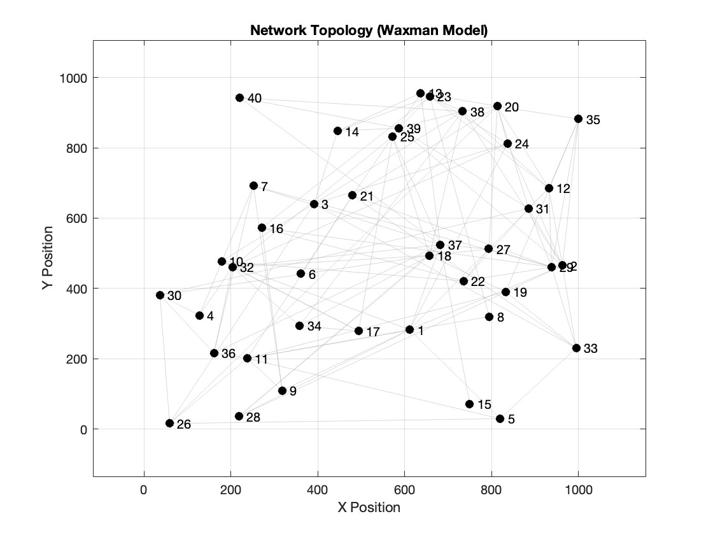
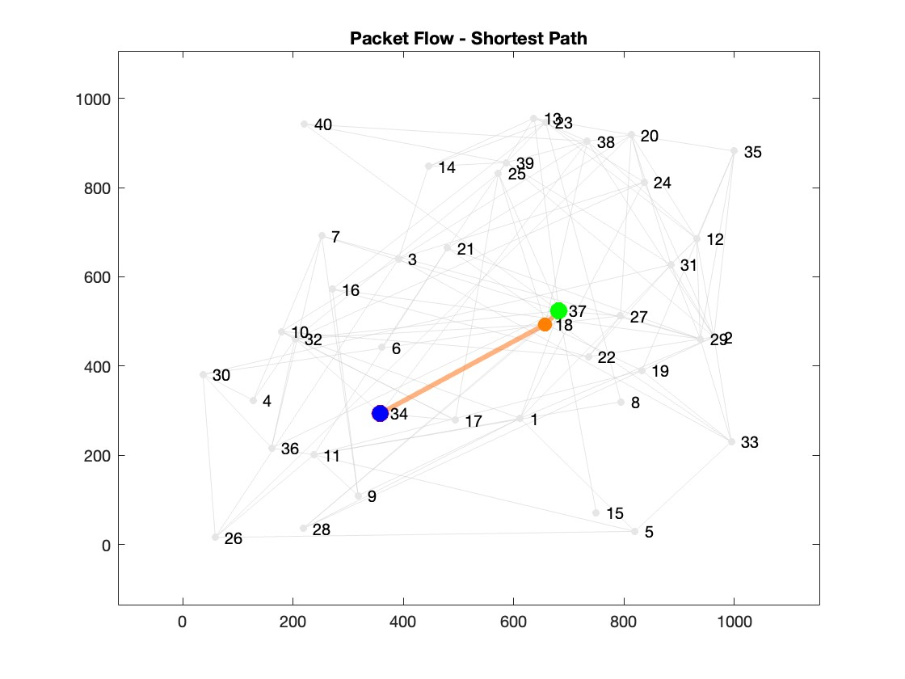
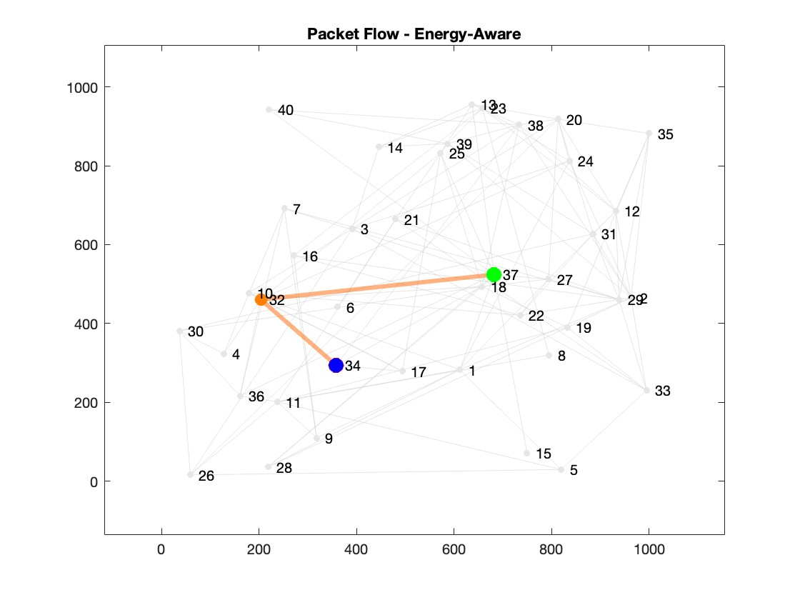
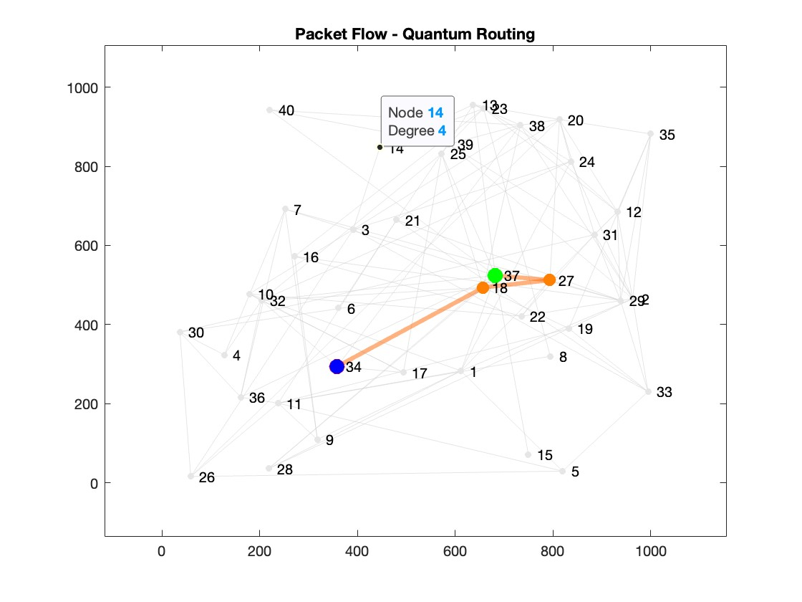
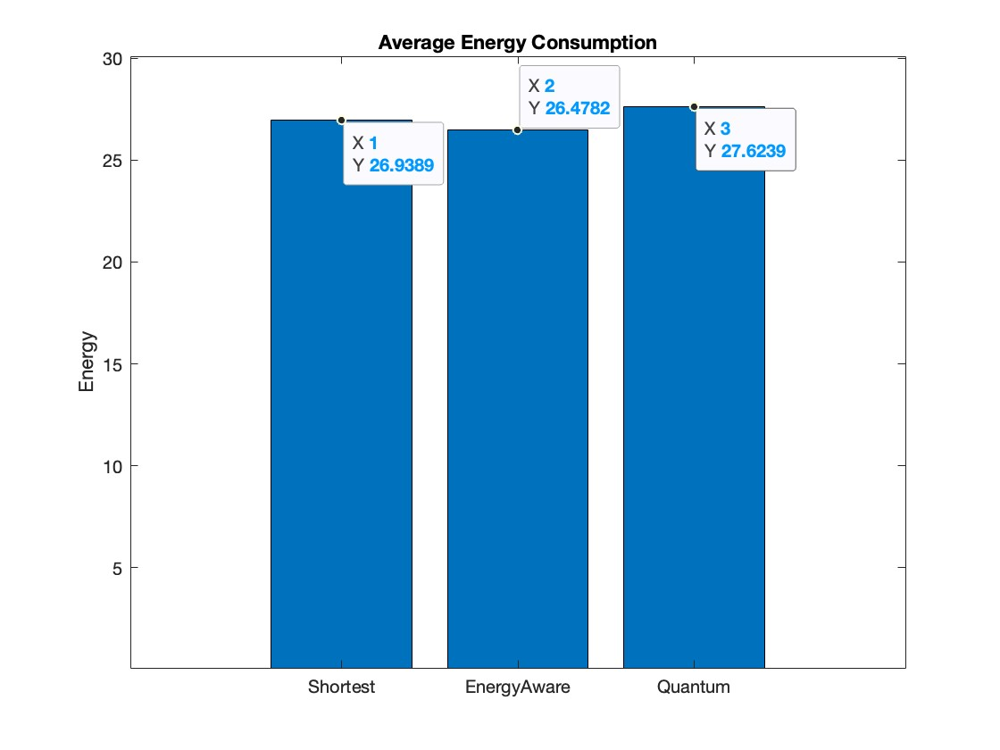
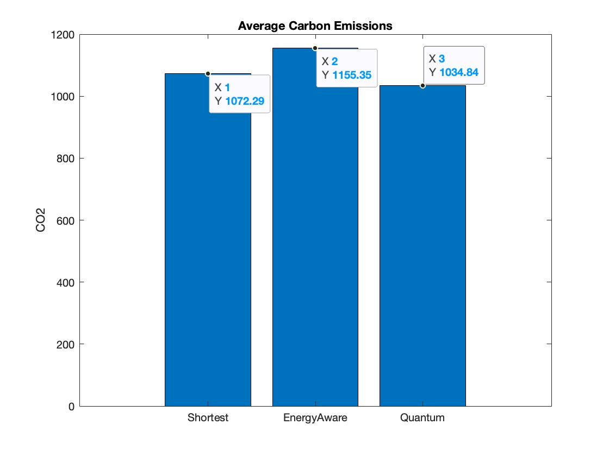
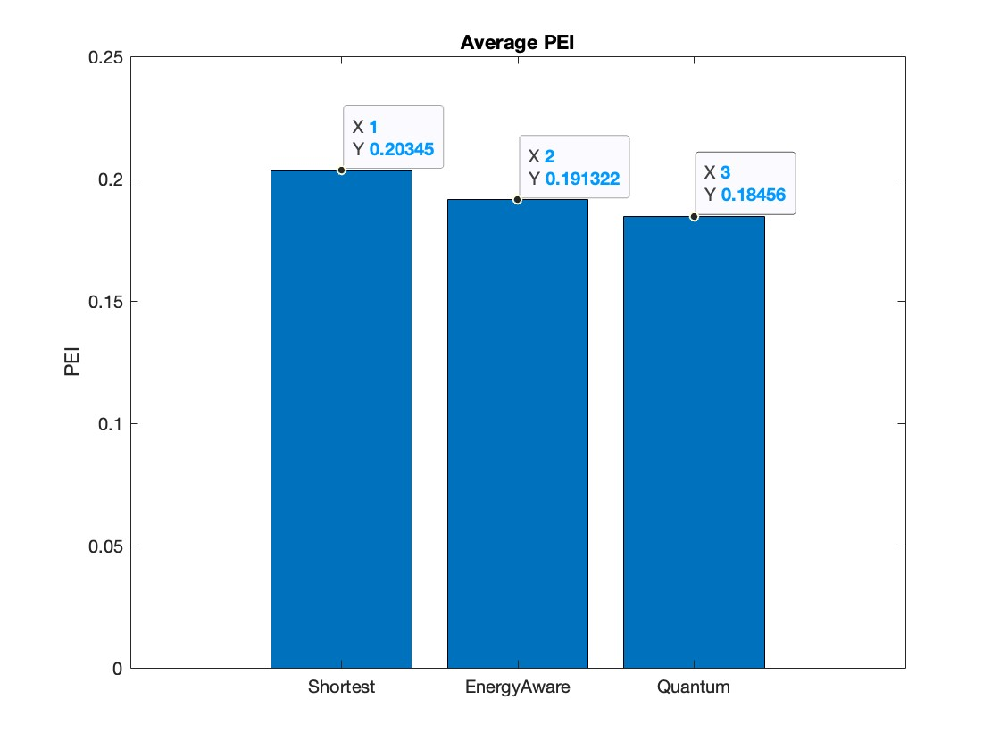
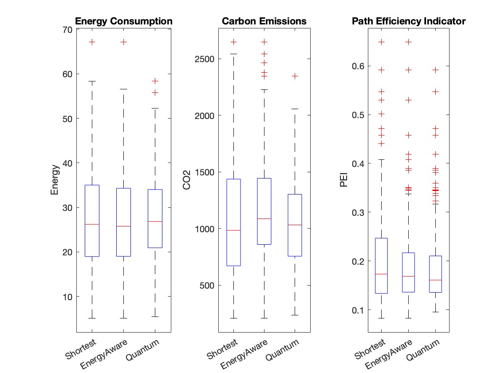

# ⚡ Quantum-Inspired Energy-Aware Network Routing

<div align="center">
Sustainable Multi-Objective Routing using QUBO-Inspired Optimization

*A research-oriented MATLAB simulation exploring greener communication
networks through latency, energy, and carbon-aware routing.*


</div>

------------------------------------------------------------------------

## 🌍 Why this project?

Modern routing protocols are optimized primarily for **latency** while
largely ignoring the environmental impact of communication networks.

This project investigates whether **quantum-inspired optimization** can
improve routing decisions by simultaneously minimizing:

-   ⚡ Energy Consumption
-   🌱 Carbon Emissions
-   ⏱️ Network Latency

Instead of requiring quantum hardware, the optimization is evaluated
using a **QUBO-inspired objective function** inside a classical MATLAB
simulation.

------------------------------------------------------------------------

# 📸 Project Preview


## Network Topology



## Routing Comparison

<p align="center">
  
  
  
</p>

<p align="center">
<b>Shortest Path</b> &nbsp;&nbsp;&nbsp;&nbsp;&nbsp;&nbsp;&nbsp;&nbsp;&nbsp;&nbsp;&nbsp;&nbsp;&nbsp;&nbsp;&nbsp;&nbsp;&nbsp;&nbsp;&nbsp;&nbsp;&nbsp;&nbsp;&nbsp;&nbsp;&nbsp;&nbsp;&nbsp;&nbsp;&nbsp;&nbsp;&nbsp;&nbsp;&nbsp;&nbsp;&nbsp;&nbsp;&nbsp;&nbsp;&nbsp;&nbsp;&nbsp;&nbsp;&nbsp;&nbsp;&nbsp;&nbsp;&nbsp;&nbsp;&nbsp;&nbsp;
<b>Energy Aware</b> &nbsp;&nbsp;&nbsp;&nbsp;&nbsp;&nbsp;&nbsp;&nbsp;&nbsp;&nbsp;&nbsp;&nbsp;&nbsp;&nbsp;&nbsp;&nbsp;&nbsp;&nbsp;&nbsp;&nbsp;&nbsp;&nbsp;&nbsp;&nbsp;&nbsp;&nbsp;&nbsp;&nbsp;&nbsp;&nbsp;&nbsp;&nbsp;&nbsp;&nbsp;&nbsp;&nbsp;&nbsp;&nbsp;&nbsp;&nbsp;&nbsp;&nbsp;&nbsp;&nbsp;&nbsp;&nbsp;&nbsp;&nbsp;&nbsp;&nbsp;
<b>Quantum Inspired</b>
</p>

------------------------------------------------------------------------

# ✨ Highlights

-   Realistic Waxman topology generation
-   Yen's K-Shortest Paths candidate generation
-   Classical Shortest Path Routing
-   Energy-Aware Routing
-   Quantum-inspired QUBO optimization
-   300 simulated traffic flows
-   Carbon-aware routing evaluation
-   Telemetry-driven performance analysis
-   MATLAB visualizations and packet flow simulation

------------------------------------------------------------------------

# 🧠 Research Contribution

Unlike conventional routing approaches, this work formulates routing as
a **multi-objective optimization problem**.

The optimization simultaneously considers:

-   Network latency
-   Link energy consumption
-   Node carbon intensity

The routing objective is transformed into a **Quadratic Unconstrained
Binary Optimization (QUBO)** formulation inspired by QAOA.

------------------------------------------------------------------------

# 🏗️ System Pipeline

``` text
Waxman Network
      │
      ▼
Candidate Path Generation
(Yen's K Shortest Paths)
      │
      ▼
Routing Algorithms
 ├── Shortest Path
 ├── Energy Aware
 └── Quantum Inspired
      │
      ▼
Telemetry Collection
      │
      ▼
Performance Evaluation
(Energy • Carbon • PEI)
```

------------------------------------------------------------------------

# ⚙️ Routing Algorithms

| Algorithm | Latency | Energy | Carbon |
|-----------|:--------:|:------:|:-------:|
| **Shortest Path** | ✅ | ❌ | ❌ |
| **Energy Aware** | ✅ | ✅ | ❌ |
| **Quantum Inspired** | ✅ | ✅ | ✅ |

------------------------------------------------------------------------

# 📊 Experimental Setup

| Parameter | Value |
|-----------|------:|
| **Nodes** | 40 |
| **Traffic Flows** | 300 |
| **Candidate Paths** | 12 |
| **Network Model** | Waxman |
| **Platform** | MATLAB |

------------------------------------------------------------------------

# 📈 Results

## Average Energy Consumption



## Average Carbon Emissions



## Path Efficiency Indicator



## Distribution Comparison



------------------------------------------------------------------------

# 📂 Project Structure

``` text
.
├── screenshots/
├── main_simulation.m
├── generate_waxman_topology.m
├── shortest_path_routing.m
├── energy_aware_routing.m
├── qaoa_routing_simulated.m
├── yen_k_shortest_paths.m
├── compute_metrics.m
├── compute_link_metrics.m
├── plot_network_topology.m
├── plot_results.m
└── animate_packet_flow.m
```

------------------------------------------------------------------------

# 🚀 Getting Started

``` bash
git clone https://github.com/Ria-Chadha-05/Quantum-Inspired-Energy-Aware-Network-Routing.git
cd Quantum-Inspired-Energy-Aware-Network-Routing
```

Run in MATLAB

``` matlab
main_simulation
```

------------------------------------------------------------------------

# 🔬 Future Work

-   Larger-scale communication networks
-   SDN integration
-   Dynamic traffic workloads
-   Real quantum backend evaluation
-   Hybrid quantum-classical optimization

------------------------------------------------------------------------

# 📚 Citation

If this repository contributes to your work, please consider citing the 
accompanying paper.

------------------------------------------------------------------------

# 📚 Author 

Ria Chadha

------------------------------------------------------------------------

<div align="center">
⭐ If you found this project useful, consider giving it a star.
</div>
